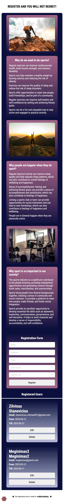

# THIS IS PROJECT - REGISTRATION PAGE TO DO SPORTS!

## Getting Started

To get started, you will need to run FE and BE script to have compatible
and working page.

So first you will need:

```bash
- Go to be folder -> open temrinal and run `npm install` command && npm run dev-be
- Make sure that there are no error mesage and you see `MongoDB connected`
and that it's running pon 5012 server (make sure this host is clear)
- If you want to test it rename http file to .http and test it.
```

Secondly you will need:

```bash
- Go to fe folder -> open NEW temrinal and run `npm install` command
&& npm run dev-fe -> it will open localhost that is with free usage.
Open it and check if app is visible
```

Once both things are running in the separate terminals
you can test it by adding new user, editing it, removing it.
This app is build using mobile-first approach



